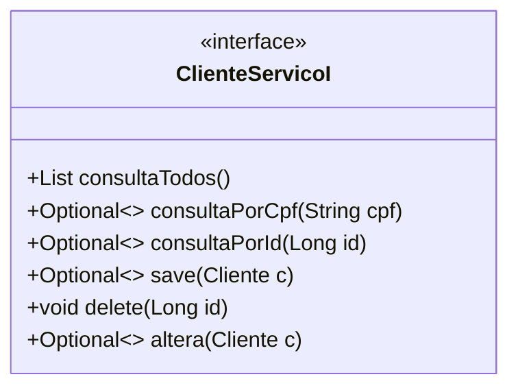
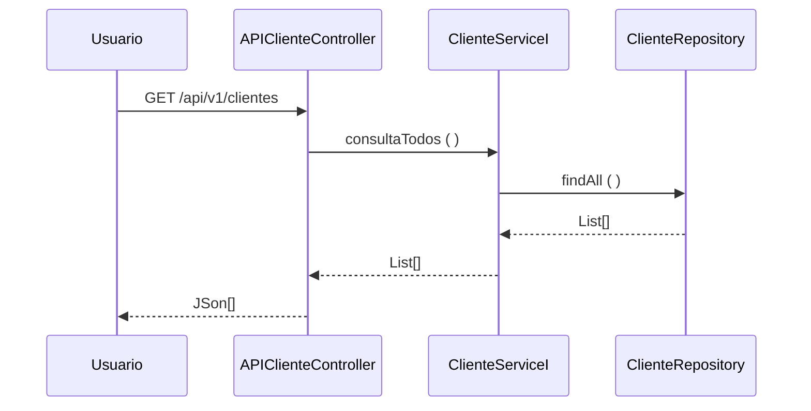

### Fatec ZL - Centro Paula Souza
##### Disciplina - Programação Web III
Grupo 3
- <a href = "https://github.com/Beatriz-Chagas">Beatriz Chagas de Sousa</a>
- <a href = "https://github.com/eloocunha">Eloisa da Cunha</a>
- <a href = "https://github.com/PriscilaDias2003">Priscila Gabriele Dias Ribeiro</a>
- <a href = "https://github.com/GiovannaBerato">Giovanna Berato</a>
##### Processo de Desenvolvimento de Software - PDS
> O PDS segue uma abordagem interativa incremental adaptada do Scrum. Cada interação tem uma definição de pronto estabelecida com objetivo de controlar a qualidade.
##### Estudo de Caso – Sistema Integrado de Gestão
> Colocar  microempresários  e  clientes  em  contato  através  da  tecnologia  por meio   da   nossa   plataforma.   queremos   melhorar   a   forma   de relacionamento empresário/cliente,  facilitando  o  caminho  entre  os  dois,  tornando  mais  simples  e rápido o encontro dos dois.
##### Product Backlog
- RU01 - Compras - Registra e acompanha os processos de compras na organização, prevê a entrega programada de pedidos de compra
- RU02 - Recebimento - Registra, controla e informa sobre a entrada de mercadorias e integra as informações dos dados da nota fiscal de entrada com o estoque
- RU03 - Vendas – Registra e acompanha as vendas mantendo as informações integradas com o controle de estoque.
##### Sprint Backlog
> Cada requisito tem um identificador único de maneira que seja possível rastrear a necessidade do cliente com a implementação do software.

| Identificador | Descrição | Prioridade |
| ------------ | ------------------------------------------------------------------------ | ------|
|  |                         MICROEMPREENDEDOR | |
| REQ01 – Cadastrar Microempreendedor | Como – Microempreendedor, Eu quero – Me cadastrar, De maneira que – Colocar minha empresa em evidência para que clientes possam ter acesso ao meu negócio.| Média |
| REQ02 – Login do Microempreendedor| Como – Microempreendedor, Eu quero – Me logar no sistema, De maneira que – Ter acesso às informações cadastradas e ter outras funcionalidades de microempreendedor do site.| Alta |
| REQ03 – Alterar Dados | Como – Microempreendedor, Eu quero – Poder alterar minhas informações, De maneira que – Conseguir muda-las quando não são mais válidas ou inverossímeis, exemplo: telefone, endereço da empresa. | Alta |
| REQ04 – Chat | Como – Microempreendedor, Eu quero – Ter acesso ao chat com clientes, De maneira que – Ter um contato direto com eles e poder sanar possíveis dúvidas, ampliando assim a rede de consumidores. | Baixa |
| REQ05 – Logout | Como – Microempreendedor, Eu quero – Deslogar do sistema, De maneira que –  Poder sair com segurança do site e não deixar meus dados expostos. | Baixa |
|  | CLIENTE | |
| REQ06 – Cadastrar Cliente | Como – Cliente, Eu quero – Me cadastrar no sistema, De maneira que – Poder ter acesso as microempresas disponíveis no aplicativo do sistema. | Média |
| REQ07 – Login do Cliente| Como – Cliente, Eu quero – Me logar no sistema, De maneira que – Ter acesso às informações cadastradas e as empresas salvas em meus destaques| Alta |
| REQ08 – Alterar Dados | Como – Cliente, Eu quero – Poder alterar minhas informações, De maneira que – Conseguir muda-las quando não são mais válidas ou inverossímeis, exemplo: telefone, endereço da prestação de serviço | Alta |
| REQ09 – Destaque de empresa | Como – Cliente, Eu quero – Conseguir salvar empresas que gostei e colocar em meus destaques para poder ter acesso mais tarde, De maneira que – Que seja mais simples encontrar empresas que gostei no sistema e ter um melhor controle de serviços. | Baixa |
| REQ10 – Acessar localização da empresa| Como – Cliente, Eu quero – Conseguir visualizar o endereço disponibilizado pela empresa no mapa., De maneira que – Conseguir saber exatamente onde a empresa está localizada| Baixa |
| REQ11 – Chat | Como – Cliente, Eu quero – Conseguir colocar comentários nos perfis das empresas., De maneira que – Dar um feedback para a empresa, para outros clientes que queiram contratar seus serviços e relatar dúvidas sobre serviços. | Baixa |
| REQ12 – Logout | Como – Cliente, Eu quero – Deslogar do sistema, De maneira que – Poder sair com segurança do site e não deixar meus dados expostos. | Baixa |
|  | SISTEMA  |  |
| REQ013 – Listagem de empresas | Como – Sistema, Eu quero – Fazer a listagem de microempresas, De maneira que – Que os clientes do sistema possam ter acesso as microempresas cadastradas no sistema e para que as microempresas possam ter a visibilidade necessária para que sua gama de usuários e consumidores aumente.| Média |

##### Definição de pronto
> O sprint será considerado concluido quando:
> 1) Os casos de teste de aceitação forem executados e obtiverem 100% de satisfatorios. Os casos de teste (CT) são rastreáveis para os requisiitos (REQ). O elo de rastreabilidade
é estabelecido pelo identificador do caso de teste.
> 2) Depois de executado os casos de teste com 100% de satisfatorios o código deve ser armazenado no github (commit).

##### Casos de teste
| Identificador | Cenário de uso |
| ------------ | ------------------------------------------------------------------------ |
| REQ01CT01 | Dado (setup) que o CPF do cliente não está cadastrado; Quando (ação) o usuário confirma o cadastro; Então (resultado esperado) o sistema envia uma mensagem de cadastro realizado com sucesso |
| REQ01CT02 | Dado (setup) que o CPF do cliente está cadastrado; Quando (ação) o usuário confirma o cadastro; Então (resultado esperado) o sistema rejeita e envia uma mensagem de dados inválidos |
>
O modelo de dominio (Larman, 2006 - classes conceituais ou classes de negócio) foi definido considerando as seguintes classes:
![modelo de dominio]
A arquitetura segue uma abordagem orientada a serviços. Os serviços foram classificados em três tipos (ERL, 2007):
- **1. Serviços utilitários**. Implementam funcionalidades comuns a vários tipos de aplicações, como, por exemplo: log, notificação, transformação de informações. Um exemplo de serviço utilitário é um serviço de conversão de moeda que
poderá ser acessado para calcular a conversão de uma moeda (por exemplo, dólares) para outra (por exemplo, euros).
- **2. Serviços de entidade (serviços de negócios)**. Derivado de uma ou mais entidades de negócio (domínio), possuindo um alto grau de reutilização. Geralmente são serviços que fazem operações CRUD (Create, Read, Update e Delete).
- **3. Serviços de tarefa (coordenação de processos-workflow)**. Tipo de serviço mais específico que possui baixo grau de reuso. Consome outros serviços para atender seus consumidores. São serviços que suportam um processo de negócios
amplo que geralmente envolve atividades e atores diferentes. Um exemplo de serviço de coordenação em uma empresa é um serviço de pedidos em que os pedidos são feitos, os produtos são aceitos e os pagamentos são efetuados.
A visão lógica da arquitetura para API de Cliente é apresentada na figura abaixo. A visã lógica descreve como o código está organizado, as classes os pacotes e os relacionamentos entre eles.

>A entidade Cliente foi identificada como um serviço (ERL, 2007 - serviço do tipo entidade) o contrado das operações de sistema (LARMAN, 2006, pag.140) foram definidas no diagrama abaixo.

>O diagrama de sequência descreve como os varios componentes arquiteturais colaboram para manipular uma operação de sistema (exemplo para operação consultaTodos())

>Referencias
- [1] KRUCHTEN, Philippe. Reference: Title: Architectural blueprints—the “4+ 1” view model of software architecture. IEEE software, v. 12, n. 6, 1995.
- [2] RICHARDSON, Chris. Microservices patterns: with examples in Java. Simon and Schuster, 2018.
- [3] ERL, Thomas. SOA principles of service design (the Prentice Hall service-oriented computing series from Thomas Erl). Prentice Hall PTR, 2007.
- [4] LARMAN, Craig. Utilizando UML e padrões. 2aed., Porto Alegre: Bookman Editora, 2006 (pag. 147).
